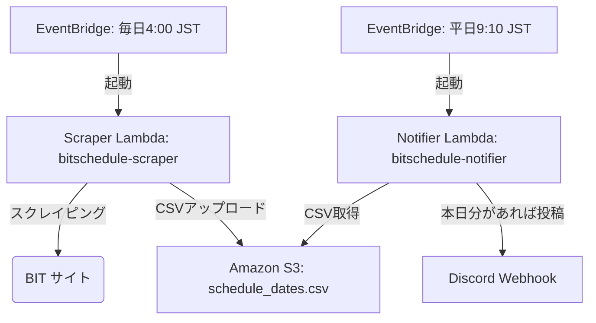

# BIT 競売スケジュール自動通知システム (bitschedule)

このリポジトリは、不動産競売物件情報サイト (BIT) から裁判所ごとの閲覧開始スケジュールを抽出し、その日の閲覧開始情報を Discord に自動通知する AWS 上のサーバーレスシステムです。

推奨構成である「S3データ連携・分離方式（パターンB）」を採用しており、スクレイピング（ダウンロード）処理と Discord 通知処理をそれぞれ独立した Lambda 関数で実行します。

---

## 1. システム構成・処理フロー



1.  **スクレイピングフェーズ（毎日 4:00 JST / 19:00 UTC 実行）**
    *   EventBridge によって `bitschedule-scraper` が起動。
    *   BIT から最新スケジュールをスクレイピングしてパースし、CSV データとして Amazon S3 バケットにアップロードして保存します。
2.  **通知フェーズ（平日 9:10 JST / 0:10 UTC 実行）**
    *   EventBridge によって `bitschedule-notifier` が起動。
    *   S3 から CSV データを読み込み、当日の閲覧開始情報があれば Discord Webhook へメッセージを投稿します。**（※該当案件がない日はDiscord通知をスキップして正常終了します。）**

---

## 2. ディレクトリ構成

```text
.
├── .gitignore               # Git管理対象外設定
├── README.md                # 本ドキュメント
├── requirements.txt         # 依存ライブラリ (Scraper Lambdaのビルド時に自動同梱)
├── lambda_scraper.py        # 【新規】AWS Lambda 用スクレイピングスクリプト
├── lambda_notifier.py       # 【新規】AWS Lambda 用 Discord 通知スクリプト
├── deploy.sh                # AWSデプロイスクリプト (S3作成/IAM/2Lambda/EventBridgeの一括設定)
├── extract_schedule.py      # ローカル実行用スケジュール抽出スクリプト (参考用)
├── lambda_function.py       # 旧AWS Lambda 用通知スクリプト (参考用)
└── .github/
    └── workflows/
        └── lint.yml         # GitHub Actions 用 CI ワークフロー
```

*※ `schedule_dates.csv` および `download/`（キャッシュフォルダ）は、AWS S3 および Lambda の `/tmp` 領域を利用するため、Gitでの管理およびデプロイ時の同梱は不要になりました。*

---

## 3. セットアップ・デプロイ手順

### 3.1. 動作要件 (Prerequisites)
*   **Python 3.11** (Lambda ランタイムおよびビルド時の pip 用)
*   **AWS CLI** (`aws` コマンドが設定済みで、対象アカウントへのデプロイ権限があること)
*   **Discord Webhook URL**

### 3.2. デプロイの実行
`deploy.sh` に Discord Webhook URL を渡して実行します。S3 バケット名を指定しない場合、AWS アカウント ID を用いた一意のバケット（`bitschedule-data-<ACCOUNT_ID>`）が自動的に作成されます。

```bash
# 自動生成されるS3バケット名を使用する場合
./deploy.sh <YOUR_DISCORD_WEBHOOK_URL>

# S3バケット名を明示的に指定する場合
./deploy.sh <YOUR_DISCORD_WEBHOOK_URL> <YOUR_UNIQUE_S3_BUCKET_NAME>
```

実行される処理：
1.  S3 バケットの作成（存在しない場合）
2.  Lambda 用 IAM 実行ロールのセットアップ（S3 への読み書き権限付きのポリシーをインラインアタッチ）
3.  `requirements.txt` の依存パッケージを同梱した `bitschedule-scraper` 関数のデプロイ（タイムアウト: 5分）
4.  `bitschedule-notifier` 関数のデプロイ（タイムアウト: 30秒）
5.  EventBridge トリガーの設定（毎日 4:00 JST の Scraper 起動 / 平日 9:10 JST の Notifier 起動）

---

## 4. 動作テスト

デプロイ後、以下の手順で手動テストが行えます。

### 4.1. スクレイピング（S3データの更新）のテスト
以下のコマンドを実行すると、`bitschedule-scraper` が即座に起動し、BIT からデータを取得して S3 に保存します。

```bash
aws lambda invoke --function-name bitschedule-scraper --cli-read-timeout 300 response_scraper.json && cat response_scraper.json && rm response_scraper.json
```

### 4.2. Discord通知のテスト
スクレイパーの実行が完了し、S3 に `schedule_dates.csv` が作成されたら、以下のコマンドで通知処理をテストできます。

```bash
aws lambda invoke --function-name bitschedule-notifier response_notifier.json && cat response_notifier.json && rm response_notifier.json
```
本日付の閲覧開始スケジュールがある場合、Discord に通知が届きます。**（※該当案件がない場合はDiscordには通知されず、レスポンスに `No matches for today. Notification skipped.` と返ります。）**

---

## 5. 運用上の注意・制限事項

1.  **スクレイピングエラーの監視**:
    `bitschedule-scraper` でパースエラーやネットワークエラーが発生した場合、指定された `DISCORD_WEBHOOK_URL` 宛てにエラーログが直接通知されるエラーハンドリングロジックが組み込まれています。
2.  **EventBridge トリガーの永続性**:
    以前のバージョンとは異なり、EventBridge ルールの cron スケジュールに年制限を設けていないため（`*` 指定）、永続的に自動起動し続けます。手動で停止したい場合は、AWS コンソールから EventBridge ルールを「無効化」してください。
